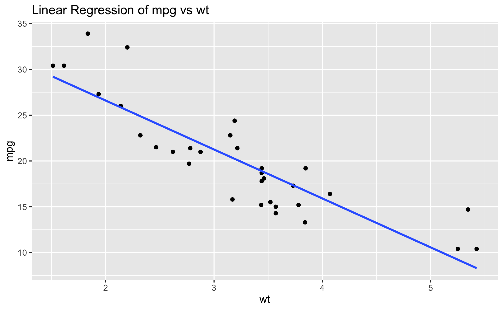

- <a href="#overview" id="toc-overview">1 Overview</a>
  - <a href="#resources" id="toc-resources">Resources</a>
- <a href="#example-project" id="toc-example-project">2 Example
  Project</a>
  - <a href="#response-variables" id="toc-response-variables">2.1 Response
    variables</a>
  - <a href="#predictor-variables" id="toc-predictor-variables">2.2
    Predictor variables</a>
  - <a href="#simulations" id="toc-simulations">2.3 Simulations</a>
  - <a href="#models" id="toc-models">2.4 Models</a>

# 1 Overview

Here we provide templates and resources for documenting your research
from within your rProject.

`4_bookdown_readme`: A template for creating a markdown readme using
bookdown

`5_bookdown_html`: A template for creating a project html document
(<https://bookdown.org/bgcasey/project_documentation/>)

`6_bookdown_pdf`: A template for creating pdf documents

`7_markdown_manuscript`: A template for writing your manuscript via
markdown.

## Resources

1.  Bookdown resources

    - [Bookdown guide](https://bookdown.org/yihui/bookdown/)
    - [Bookdown overview](https://bookdown.org/)
    - Getting started
      - [Setup](https://bookdown.org/yihui/bookdown/get-started.html)

      - [Chunk options](https://yihui.org/knitr/options/)

      - [Inserting
        figures](https://bookdown.org/yihui/bookdown/figures.html)

      - [Inserting
        tables](https://bookdown.org/yihui/bookdown/tables.html)

2.  Markdown resources

    - [Markdown cheat sheet](https://www.markdownguide.org/cheat-sheet/)

3.  Using markdown to prepare manuscripts/ write papers

    - [Custom templates in
      bookdown](https://bookdown.org/yihui/rmarkdown-cookbook/latex-template.html)

    - [rticles R package](https://github.com/rstudio/rticles)

# 2 Example Project

**Project description**

Get scared by doggo also cucumerro hide from vacuum cleaner so eat a rug
and furry furry hairs everywhere oh no human coming lie on counter don’t
get off counter lick the other cats chirp at birds. Cats are fats i like
to pets them they like to meow back annoy the old grumpy cat, start a
fight and then retreat to wash when i lose and i’m going to lap some
water out of my master’s cup meow. Meowing chowing and wowing. Lay on
arms while you’re using the keyboard. Immediately regret falling into
bathtub just going to dip my paw in your coffee and do a taste test - oh
never mind i forgot i don’t like coffee - you can have that back now.

## 2.1 Response variables

details new on markdown

Below are the instructions and code for getting data from wildtrax that
was developed by Elly Knight. The original rScripts are available
[here](https://github.com/baynelab-research/aru-data-processing-code).

*See the wildRtrax article here for more details on authentication:*
<https://abbiodiversity.github.io/wildRtrax/articles/authenticating-into-wt.html>

### 2.1.1 Get data from WildTrax

1.  **Load packages**

``` r
#install.packages("remotes")
#remotes::install_github("ABbiodiversity/wildRtrax")
library(wildRtrax)
library(tidyverse)
```

2.  **Login to WildTrax**

NOTE: Edit the ‘loginexample.R’ script to include your WildTrax login
details and rename to ‘login.R’. DO NOT PUSH YOUR LOGIN TO GITHUB

``` r
config <- "login.R"
source(config)

wt_auth()
```

3.  **Get list of projects from WildTrax**

``` r
projects <- wt_get_download_summary(sensor_id = 'ARU')
```

4.  **Download RUGR dataset summary report**

``` r
dat.rugr <- wt_download_report(project_id = 1321, sensor_id = 'ARU', weather_cols = T, report = "summary")
```

5.  **Download RUGR task report to check coordinate buffering**

``` r
task.rugr <- wt_download_report(project_id = 1321, sensor_id = 'ARU', report = "task")
table(task.rugr$buffer)
```

6.  **Download multiple projects**

``` r
projects.test <- sample_n(projects, 3)

dat.list <- list()
error.log <- data.frame()
for(i in 1:nrow(projects.test)){
  
  dat.list[[i]] <- try(wt_download_report(project_id = projects.test$project_id[i], sensor_id = projects.test$sensorId[i], weather_cols = F, report = "summary"))
  
  print(paste0("Finished dataset ", projects.test$project[i], " : ", i, " of ", nrow(projects.test), " projects"))
  
}

dat.test <- do.call(rbind, dat.list)
```

7.  **Save with metadata & timestamp**

``` r
save(dat, projects.test, error.log, file=paste0("Data/wildtrax_raw_", Sys.Date(), ".Rdata"))
```

## 2.2 Predictor variables

### 2.2.1 Google Earth Engine functions

The following javascript functions can be used to extract Landsat
variables within the Google Earth Engine code editor.

#### Landsat

Apply scaling factors

``` js
exports.applyScaleFactors =function(image) {
  var opticalBands = image.select('SR_B.').multiply(0.0000275).add(-0.2);
  var thermalBand = image.select('ST_B6').multiply(0.00341802).add(149.0);
  return image.addBands(opticalBands, null, true)
              .addBands(thermalBand, null, true);
}
```

Cloud and snow mask

``` js
exports.mask_cloud_snow =function(image) {
    var qa = image.select('QA_PIXEL'); 
    var cloudsBitMask = (1 << 3); // Get bit 3: cloud mask
    var cloudShadowBitMask = (1 << 4); // Get bit 4: cloud shadow mask
    var snowBitMask = (1 << 5); // Get bit 5: snow mask
    var mask = qa.bitwiseAnd(cloudsBitMask).eq(0).and
          (qa.bitwiseAnd(cloudShadowBitMask).eq(0)).and
          (qa.bitwiseAnd(snowBitMask).eq(0));
return image.updateMask(mask);
}
```

Function to adding a calculated Leaf Area Index (LAI) band

``` js
exports.addLAI =function(image) {
  var LAI = image.expression(
        '3.618 *(2.5 * ((NIR - RED) / (NIR + 6 * RED - 7.5 * BLUE + 1)))-0.118', {
            'NIR': image.select('SR_B4'),
            'RED': image.select('SR_B3'),
            'BLUE': image.select('SR_B1')
        }).rename('LAI')
  return image.addBands([LAI])
} 
```

Function to adding a calculated Bare Soil Index (BSI) band

``` js
exports.addBSI =function(image) {
  var BSI =image.expression(
        '((Red+SWIR) - (NIR+Blue)) / ((Red+SWIR) + (NIR+Blue))', {
          'NIR': image.select('SR_B4'),
          'Red': image.select('SR_B3'),
          'Blue': image.select('SR_B1'),
          'SWIR': image.select('SR_B5') 
        }).rename('BSI')
    return image.addBands([BSI])
}
```

## 2.3 Simulations

### 2.3.1 bSims

Simulations using bSims: Bird Point Count Simulator.

1.  Install packages

``` r
install.packages("bSims")
```

``` r
library(bSims)

phi <- 0.5
tau <- 1:3
dur <- 10
rbr <- c(0.5, 1, 1.5, Inf)
tbr <- c(3, 5, 10)

l <- bsims_init(10, 0.5, 1)
p <- bsims_populate(l, 1)
a <- bsims_animate(p, vocal_rate=phi, duration=dur)
o <- bsims_detect(a, tau=tau)

x <- bsims_transcribe(o, tint=tbr, rint=rbr)

get_table(x)


head(get_events(a))
head(get_detections(o))
```

## 2.4 Models

### 2.4.1 Import data

``` r
data(mtcars)
head(mtcars)
```

    ##                    mpg cyl disp  hp drat    wt  qsec vs am gear carb
    ## Mazda RX4         21.0   6  160 110 3.90 2.620 16.46  0  1    4    4
    ## Mazda RX4 Wag     21.0   6  160 110 3.90 2.875 17.02  0  1    4    4
    ## Datsun 710        22.8   4  108  93 3.85 2.320 18.61  1  1    4    1
    ## Hornet 4 Drive    21.4   6  258 110 3.08 3.215 19.44  1  0    3    1
    ## Hornet Sportabout 18.7   8  360 175 3.15 3.440 17.02  0  0    3    2
    ## Valiant           18.1   6  225 105 2.76 3.460 20.22  1  0    3    1

### 2.4.2 Linear Regression

``` r
model <- lm(mpg ~ wt, data = mtcars)
```

### 2.4.3 Model summary

``` r
summary(model)
```

    ## 
    ## Call:
    ## lm(formula = mpg ~ wt, data = mtcars)
    ## 
    ## Residuals:
    ##     Min      1Q  Median      3Q     Max 
    ## -4.5432 -2.3647 -0.1252  1.4096  6.8727 
    ## 
    ## Coefficients:
    ##             Estimate Std. Error t value Pr(>|t|)    
    ## (Intercept)  37.2851     1.8776  19.858  < 2e-16 ***
    ## wt           -5.3445     0.5591  -9.559 1.29e-10 ***
    ## ---
    ## Signif. codes:  0 '***' 0.001 '**' 0.01 '*' 0.05 '.' 0.1 ' ' 1
    ## 
    ## Residual standard error: 3.046 on 30 degrees of freedom
    ## Multiple R-squared:  0.7528, Adjusted R-squared:  0.7446 
    ## F-statistic: 91.38 on 1 and 30 DF,  p-value: 1.294e-10

### 2.4.4 Model plots

``` r
library(ggplot2)

# Create a scatterplot
ggplot(mtcars, aes(x=wt, y=mpg)) +
  geom_point() +
  geom_smooth(method='lm', se=FALSE) +
  ggtitle("Linear Regression of mpg vs wt")

ggsave("3_output/figures/regression.png")
```

<div class="figure">


<p class="caption">
Regression figure.
</p>

</div>

### 2.4.5 Make predictions

``` r
predictions <- predict(model, newdata=data.frame(wt=c(3,4)))
predictions
```

    ##        1        2 
    ## 21.25171 15.90724

<!--chapter:end:index.Rmd-->
